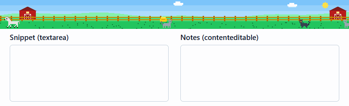
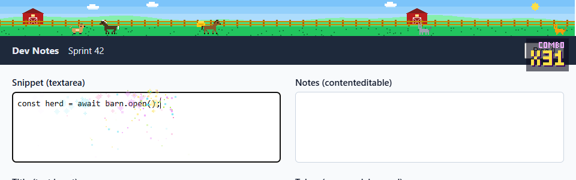
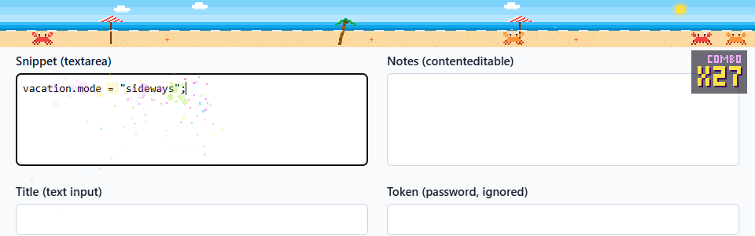
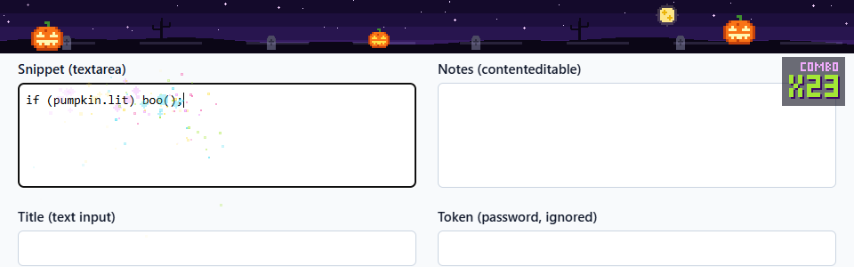
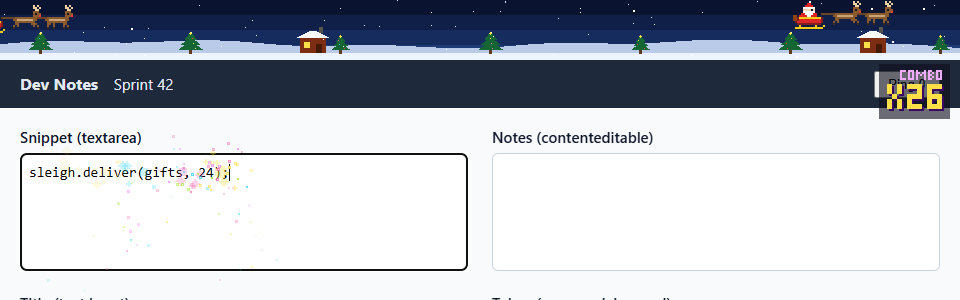
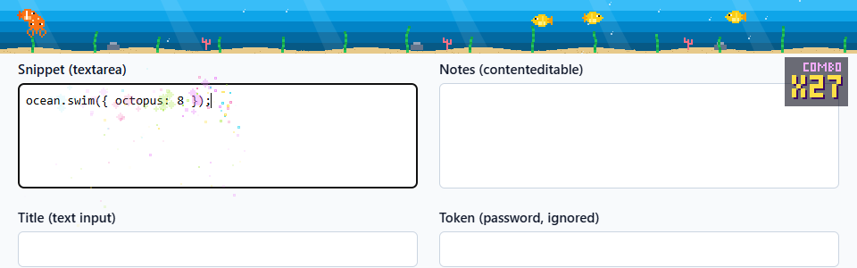
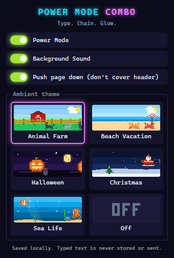

# Developer Power Mode Combo

A local-only Chrome **Manifest V3** extension that turns ordinary web text fields into a tiny arcade:
an arcade-style combo counter, neon sparks next to the caret, and original pixel-art ambient themes
with chiptune music. It is built from content scripts and a popup. There is no backend, service
worker, API key, or network access.



| Animal Farm | Beach Vacation |
| --- | --- |
|  |  |
| **Halloween** | **Christmas** |
|  |  |
| **Sea Life** | **Settings popup** |
|  |  |

The screenshots and GIF were captured from real Chrome with the unpacked extension loaded
(`npm run capture`, see below).

## Features

- **Combo counter.** Counts confirmed, keyboard-driven text edits. The arcade counter and the
  caret-adjacent neon sparks appear at **3 hits**. Every **10 hits**, the overlay shakes briefly.
  The webpage itself is never moved.
- **Reset rules.** The combo resets after **1.5 s** of inactivity or when you move to a different editor.
- **Supported editors.** Text, search, email, URL, and telephone `<input>` fields, `<textarea>`, and
  standard `contenteditable` elements on `http://` and `https://` pages.
- **What counts.** A typed character, Backspace, Delete, or Enter counts only if the browser confirms
  it with a trusted `input` event on the same editor. An IME composition counts **once**, when it is
  committed.
- **What never counts.** Password fields (including CSS-masked ones), keyboard shortcuts
  (Ctrl/Cmd/Alt), paste, drag and drop, undo/redo, autofill, and programmatic or synthetic changes.
- **Five ambient pixel-art themes.** Each theme has its own scenery and an original chiptune loop.
  The scenery and sound stay in the **top 60 px of the webpage**, not in Chrome's tab bar.

  | Theme | Moving characters | Scenery | Music |
  | --- | --- | --- | --- |
  | Animal Farm | horses, dogs, and kitties walking around | red barns, fence, hay, drifting clouds | country two-step in G major, square lead |
  | Beach Vacation | crabs scuttling sideways | sun, sea with foam, umbrellas, palm trees, starfish | calypso in F with a steel-drum-like lead and shaker |
  | Halloween | hopping jack-o'-lanterns with flickering faces | moonlit night, graves, bare trees, rolling fog | slow, spooky A-minor line with a chromatic bass |
  | Christmas | Santa's sleigh pulled by two reindeer | snowfall, snowy pines with lights, cozy cabins | festive square-wave melody with sleigh-bell ticks |
  | Sea Life | fish (clownfish, blue tang, yellow) and octopuses | light rays, swaying seaweed, coral, rising bubbles | dreamy D-dorian sine arpeggios |

- **Ambient behavior.** The scenery starts as soon as you choose a theme. It keeps animating while
  the page sits idle, and the characters respawn on their own. It runs independently of typing.
- **Compact popup.** The popup has a Power Mode toggle (on by default), a Background Sound toggle
  (on by default), and live theme previews. You can pick **Animal Farm, Beach Vacation, Halloween,
  Christmas, Sea Life, or Off**. Your choices are saved in `chrome.storage.local`.

## Install (unpacked)

1. Download or clone this repository.
2. Open `chrome://extensions` in Chrome.
3. Turn on **Developer mode** (top-right switch).
4. Click **Load unpacked** and select the **`extension/`** folder (not the repository root).
5. Pin *Developer Power Mode Combo* from the puzzle-piece menu so you can open its popup.
6. Reload any tab that was already open. Content scripts only attach to pages loaded after install.

You don't need to publish to the Chrome Web Store, build anything, or sign in.

### Preview without installing

Open [`tools/preview.html`](tools/preview.html) directly in Chrome (double-click it). It loads the same
scripts from `extension/src/` on a plain page, with an in-memory stand-in for `chrome.storage` and a
small theme / Power Mode / sound picker in place of the popup. You can try the themed band, counter,
sparks, shake, and music (after one click). Settings reset on reload, and it only affects that page;
install the extension to use it on real websites.

### Using it

- Click into a text field on any normal website and start typing. The counter appears on your third
  hit.
- Open the toolbar popup to switch Power Mode or the music on and off, or to choose a theme.
  Changes apply to open tabs right away.
- **Music needs a click or keypress first.** Chrome's autoplay policy blocks sound until you
  interact with a page. If a page hasn't had a click or keypress yet, the music starts on your
  first one.

## Privacy

- Typed content is **never saved, logged, or transmitted**. The only thing written to storage is the
  settings object `{ powerMode, sound, theme }`.
- To position the sparks, the content script briefly copies the text before the caret into a hidden
  mirror element inside the overlay's closed shadow root. The copy is cleared in the same call. For
  IME commits, the script only checks whether the committed text is empty.
- The extension asks for one permission, `storage`. It has no background worker and no
  `host_permissions`. The extension code contains no `fetch`, XHR, WebSocket, beacon, or `console` call,
  and a unit test enforces this.

## How it works

```
extension/
  manifest.json      MV3: content scripts + popup, permission "storage" only
  src/core.js        DOM-free logic: editor detection, edit tracker, combo, pools, frame limiter
  src/themes.js      original pixel-art sprites, scenery painters, scene engine, pixel font, scores
  src/audio.js       Web Audio chiptune renderer + gapless looper (all sound synthesized, no audio files)
  src/content.js     overlay, input listeners, the single animation loop
  popup/             compact settings UI with animated theme previews
  icons/             generated pixel-art icons
```

- **Isolated, click-through overlay.** One `<canvas>` sits inside a closed shadow root on a fixed
  host element. The host has `pointer-events: none`, `contain: strict`, and inline `!important`
  styles, so page CSS can't reach it and clicks pass through to the page. All listeners are passive
  and capture-phase, and none of them call `preventDefault` or `stopPropagation`.
- **One loop.** A single `requestAnimationFrame` loop drives the scenery, effects, and counter.
  Rendering is capped near **30 FPS**, and movement uses delta time clamped to 100 ms.
  The loop stops completely when nothing needs drawing.
- **Smooth music.** Each theme's score is rendered once with an `OfflineAudioContext` into a
  seamless loop buffer, then played with a native looping `AudioBufferSourceNode`. Playback runs on
  the audio thread, so busy pages or throttled frames can't cause dropouts. Theme switches crossfade.
- **Activity caps.** The overlay shows at most **5 moving characters** (2 sleighs for Christmas), with
  spawn gaps between them. It also caps **24 ink blots** and **150 typing particles**. The oldest are
  recycled first.
- **Hidden pages.** On `visibilitychange`, the loop is cancelled and the AudioContext is suspended.
- **Reduced motion.** When `prefers-reduced-motion: reduce` is set, the overlay shows a static
  counter only. You get no scenery, sparks, blots, shake, or pulse.
- **Shake.** The celebration shake offsets only the overlay canvas drawing. The page's DOM, styles,
  and scroll position are never touched, and an end-to-end test checks this.

## Compatibility and limits

- The extension works on ordinary `http://` and `https://` pages in the top frame. It **cannot** run
  on restricted pages, such as `chrome://` pages, the Chrome Web Store, other extensions' pages,
  `file://` URLs, or PDF viewers.
- It is **not** guaranteed to work with every custom editor. Canvas-based editors like Google Docs,
  editors that capture keys in hidden iframes, Monaco/CodeMirror variants that bypass native
  `input` events, and editors inside iframes or closed shadow roots may not report hits.
- The 60 px ambient band is drawn over the top of the page, so a site's header can be covered
  visually. Clicks still go through to it. Choose **Off** to hide the band.
- The overlay sits behind elements in the browser's top layer, such as fullscreen video and modal
  `<dialog>` elements.

## Tests

Requires Node.js 22 or later. The end-to-end tests also need a local Chrome. If Chrome isn't in a
standard location, set `CHROME_PATH`.

```sh
npm install          # dev-only tooling: puppeteer-core, pngjs, gifenc
npm test             # unit tests (node:test, no browser)
npm run test:e2e     # loads the unpacked extension into headless Chrome
```

The **unit tests** (`tests/unit`) cover:

- editor detection, including passwords and contenteditable hosts
- the keyboard-edit rules: shortcuts, paste, synthetic and programmatic edits, AltGr, and IME
  single-counting
- combo thresholds, the 1.5 s reset, and resets when switching editors
- particle and blot caps, the ~30 FPS limiter at 60/120/144 Hz, and delta-time invariance
- the five themes: sprite integrity, actors staying inside the 60 px band, endless respawn
  without overcrowding, and valid music scores
- manifest and privacy constraints

The **end-to-end tests** (`tests/e2e`) use real Chrome input to check:

- the overlay is click-through
- the band is confined to the top 60 px and disappears when the theme is Off
- the counter appears at 3 hits and resets after idle
- passwords, programmatic and synthetic edits, and shortcuts are ignored
- switching editors resets the combo
- IME commits count once (via CDP)
- the shake never touches the page
- reduced motion shows a static counter only
- popup settings persist

## Regenerating assets

```sh
npm run icons        # extension/icons/*.png from the 16x16 pixel-art bolt
npm run capture      # docs/*.png screenshots + docs/demo.gif from real headless Chrome
```

`npm run capture` serves `tools/demo.html` from `127.0.0.1` and loads the extension in Chrome. It then
types into the page, saves the PNG screenshots, and encodes the GIF locally.
